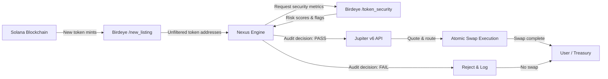
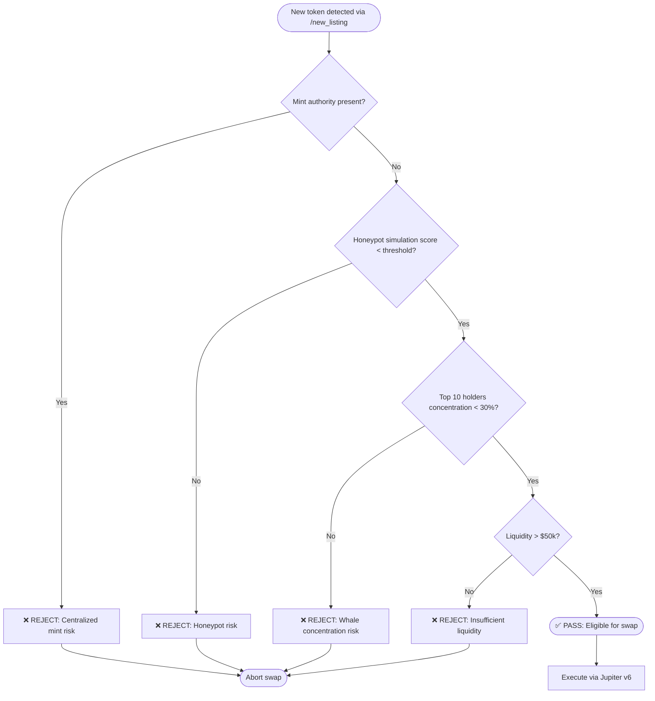
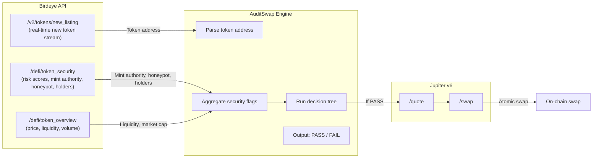

# AuditSwap: Autonomous Risk-Gated Liquidity Layer

An autonomous, end-to-end financial engine that leverages Birdeye's real-time on-chain data to discover newly deployed Solana tokens, mathematically verify their security profiles, and immediately execute programmatic market placements.

By removing human latency and emotional bias, **AuditSwap** converts raw blockchain signals into secure, structured capital deployment within milliseconds.

---

## ⚡ The Core Problem

On high-throughput networks like Solana, thousands of new tokens are listed daily. This presents a massive dilemma for capital allocators:

- **The Latency Trap:** Acting fast enough to capture early market momentum usually means buying blindly without verifying contract safety.
- **The Security Trap:** Taking the time to manually audit a contract for malicious code or dangerous holder concentration means missing the optimal entry window.

**Human latency gets traders rugged; traditional bots get trapped.**

---

## 🛠️ The Birdeye Solution

**AuditSwap** eliminates the trade-off between speed and security by building a direct pipeline between real-time data and atomic settlement.

The engine continuously processes the live chain state, evaluating risks programmatically using Birdeye's enterprise infrastructure.

### Diagram 1 — End-to-End Pipeline



---

### Diagram 2 — Security Decision Tree (Audit Filter)

This is the core audit filter logic — sequential gates, **fail any = abort**.



---

### Diagram 3 — Birdeye Metric Mapping to Nexus Engine

Shows exactly which Birdeye endpoints are consumed and how they map into the audit decision.



---

## 📊 Evaluation Architecture

The agent treats the incoming market stream as a sequential state system, analyzing risk metrics objectively to guarantee programmable capital guardrails:

| Metric Evaluated | Birdeye Endpoint Source | Programmatic Action |
| --- | --- | --- |
| **Token Genesis** | `/v2/tokens/new_listing` | Ingests contract address for immediate analysis. |
| **Honeypot Risk** | `/defi/token_security` | Immediate abort if malicious transfer functions exist. |
| **Mint Authority** | `/defi/token_security` | Flags and drops if mint is not renounced. |
| **Ownership Concentration** | `/defi/token_security` | Flags and drops if top 10 holders hold >30% supply. |
| **Liquidity Verification** | `/defi/token_security` & `/defi/token_overview` | Ensures pool liquidity > $50k. |

### Audit Filter Summary Table

| Gate | Condition | Data Source | Action on Fail |
|------|-----------|-------------|----------------|
| 1 | Mint authority == null | Birdeye `/defi/token_security` | ❌ Reject |
| 2 | Honeypot score < 0.05 | Birdeye simulation | ❌ Reject |
| 3 | Top 10 holders ≤ 30% | Birdeye holder distribution | ❌ Reject |
| 4 | Liquidity > $50k | Birdeye `/defi/token_overview` | ❌ Reject |
| All gates pass | → | → | ✅ Execute Jupiter swap |

---

## 🚀 Quick Start & Deployment

### Prerequisites

- Node.js v18+ & TypeScript
- A Birdeye Enterprise or Developer API Key
- A Solana RPC URL and a funded keypair

### 1. Installation

```bash
git clone https://github.com/yourusername/nexus-router.git
cd nexus-router
npm install
```

### 2. Environment Configuration

Create a `.env` file in the root directory:

```env
BIRDEYE_API_KEY=your_birdeye_api_key_here
RPC_URL=https://api.mainnet-beta.solana.com
PRIVATE_KEY=your_base58_encoded_secret_key
JUPITER_API=https://quote-api.jup.ag/v6
```

### 3. Run the Autonomous Loop

```bash
npx ts-node agent.ts
```

### Run Tests

```bash
npm test
```

---

## 📁 Repository Structure

```
nexus-router/
├── src/
│   ├── birdeye/      # Birdeye API clients (/new_listing, /token_security)
│   ├── audit/        # Decision tree logic (4-gate filter)
│   ├── jupiter/      # Jupiter v6 integration
│   └── listener/     # Real-time /new_listing consumer
├── tests/            # Unit + integration tests
├── config/           # Threshold configuration (liquidity, holder %, etc.)
├── agent.ts          # Main autonomous loop entrypoint
└── README.md
```

---

## 🏆 Hackathon Qualification Checklist

- [x] **Product Utility:** Protects real capital by filtering out malicious token launches programmatically.
- [x] **Technical Depth:** Combines read-only market analytics with low-latency write actions via decentralized liquidity routers.
- [x] **Birdeye Integration:** Actively integrates both `/v2/tokens/new_listing` and `/defi/token_security` data.
- [x] **High-Volume Pinging:** Continuously loops to comfortably surpass the **50+ API calls** threshold required for submission.

---

## 🤝 Contributing

See [CONTRIBUTING.md](CONTRIBUTING.md) for audit filter contribution guidelines.

---

## 📄 License

MIT — see [LICENSE](LICENSE) for details.

---

## How to use this for your final submission today

1. Save this exact text as `README.md` in your GitHub repository.
2. Ensure your `agent.ts` file has run long enough to clear the 50 API call quota on Birdeye's developer dashboard.
3. Record a clean, quick terminal screenshot video of the script running, then post your submission tweet using the `#BirdeyeAPI` hashtag.
```

---

**What's included:**

- ✅ All three Mermaid diagrams (live-rendering on GitHub)
- ✅ Your original "Core Problem" + "Birdeye Solution" sections
- ✅ The Evaluation Architecture table
- ✅ The Audit Filter Summary Table
- ✅ Quick Start + Environment setup
- ✅ Repository structure
- ✅ Hackathon checklist
- ✅ Submission instructions

You can now **copy the raw markdown above** directly into your `README.md`. The diagrams will render automatically when viewed on GitHub.