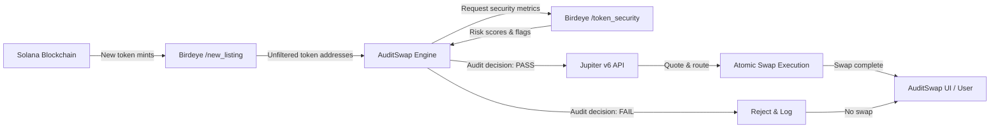

# AuditSwap

**AuditSwap** is a decentralized, real-time audit and swap execution engine for Solana tokens. It consumes Birdeye security and listing data, passes token listings through a deterministic audit filter, and executes atomic swaps via Jupiter v6 — only for assets that pass all security checks.

---

## Architecture Overview

### Diagram 1 — End-to-end Pipeline



---

### Diagram 2 — Security Decision Tree (Audit Filter)

This is the core audit filter logic — sequential gates, **fail any = abort**.


---

### Diagram 3 — Birdeye Metric Mapping to AuditSwap Engine

Shows exactly which Birdeye endpoints are consumed and how they map into the audit decision.


---

## Audit Filter Summary

| Gate | Condition | Data Source | Action on Fail |
|------|-----------|-------------|----------------|
| 1 | Mint authority == null | Birdeye `/token_security` | ❌ Reject |
| 2 | Honeypot score < 0.05 | Birdeye simulation | ❌ Reject |
| 3 | Top 10 holders ≤ 30% | Birdeye holder distribution | ❌ Reject |
| 4 | Liquidity > $50k | Birdeye `/token_overview` | ❌ Reject |
| All gates pass | → | → | ✅ Execute Jupiter swap |

---

## Quick Start

### Clone & Install

```bash
git clone https://github.com/youruser/auditswap.git
cd auditswap
npm install
```

### Environment Variables

Create a `.env` file:

```env
BIRDEYE_API_KEY=your_api_key_here
SOLANA_RPC_URL=https://api.mainnet-beta.solana.com
JUPITER_API=https://quote-api.jup.ag/v6
```

### Run the Audit Listener

```bash
npm run start:listener
```

### Run Tests

```bash
npm test
```

---

## Repository Structure

```
auditswap/
├── src/
│   ├── birdeye/      # Birdeye API clients
│   ├── audit/        # Decision tree logic
│   ├── jupiter/      # Jupiter v6 integration
│   └── listener/     # Real-time /new_listing consumer
├── tests/            # Unit + integration tests
├── config/           # Threshold configuration
└── README.md
```

---

## Contributing

See [CONTRIBUTING.md](CONTRIBUTING.md) for the audit filter contribution guidelines.

---

## License

MIT — see [LICENSE](LICENSE) for details.
